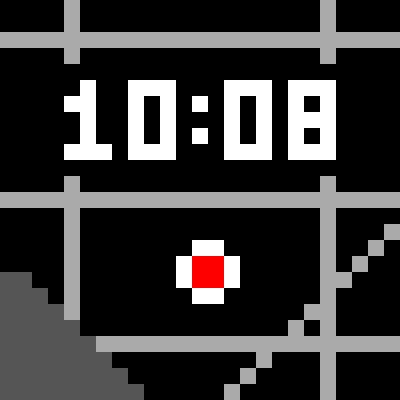

# Map Face — 25×25 pixel icon

A 25×25 pixel-art icon that condenses the watchface's visual identity into a
single tile: a dark **Geoapify dark-matter map** (black land, grey road grid,
a lake with a stepped coastline), the **time rendered on top** in white with
the app's drop-shadow halo, and the **centre location dot** drawn exactly as
`main.c` does — a white ring with a red core.



Files:

| File | Purpose |
| --- | --- |
| `icon-25.png` | The actual 25×25 icon. |
| `icon-25@16x.png` | 400×400 nearest-neighbour preview. |
| `make_icon.py` | Generator (stdlib only) — edit the grid and re-run. |

## Palette

The five colours are not arbitrary: the first four are the app's canonical
map buckets (the phone snaps every map pixel to exactly these greys before
recolouring), and the red is the location-dot core from `main.c`.

| Colour | Hex | Role in the app |
| --- | --- | --- |
| Black | `#000000` | Land / watchface background |
| Dark grey | `#555555` | Water |
| Light grey | `#AAAAAA` | Roads (solid casing + fill) |
| White | `#FFFFFF` | Labels / time digits / dot ring |
| Red | `#FF0000` | Location-dot core |

## Composition

```
....#...............#....   . #000000  land
....#...............#....   ~ #555555  water
#########################   # #AAAAAA  roads
....#...............#....   @ #FFFFFF  time / dot ring
.........................   O #FF0000  dot core
.....@..@@@...@@@.@@@....
....@@..@.@.@.@.@.@.@....
.....@..@.@...@.@.@@@....
.....@..@.@.@.@.@.@.@....
....@@@.@@@...@@@.@@@....
.........................
....#...............#....
#########################
....#...............#....
....#...............#...#
....#.......@@......#..#.
....#......@OO@.....#.#..
~~..#......@OO@.....##...
~~~.#.......@@......#....
~~~~#..............##....
~~~~~.............#.#....
~~~~~~###################
~~~~~~~.........#...#....
~~~~~~~~.......#....#....
~~~~~~~~~.....#.....#....
```

* **Road grid + diagonal avenue** — three horizontal and two vertical 1-px
  streets plus a diagonal avenue, echoing the city-grid look of the map.
  The vertical street on the left ends at the lake shore.
* **`10:08`** — a 3×5 pixel face at the classic watch-marketing time, with a
  1-px black halo punched through the roads, mirroring the watchface's
  drop-shadow that keeps the time legible over any map.
* **Location dot** — 4×4 rounded white ring with a 2×2 red core, centred
  horizontally under the colon, just like the map-centre marker.
* **Lake** — a `#555555` body in the bottom-left with a stepped diagonal
  coastline, so the water bucket is represented too.

Note: this icon uses the full colour identity (incl. the red dot). For a
Pebble `menuIcon` resource on black-and-white platforms (aplite/diorite),
drop the red core to white and the water to black.
